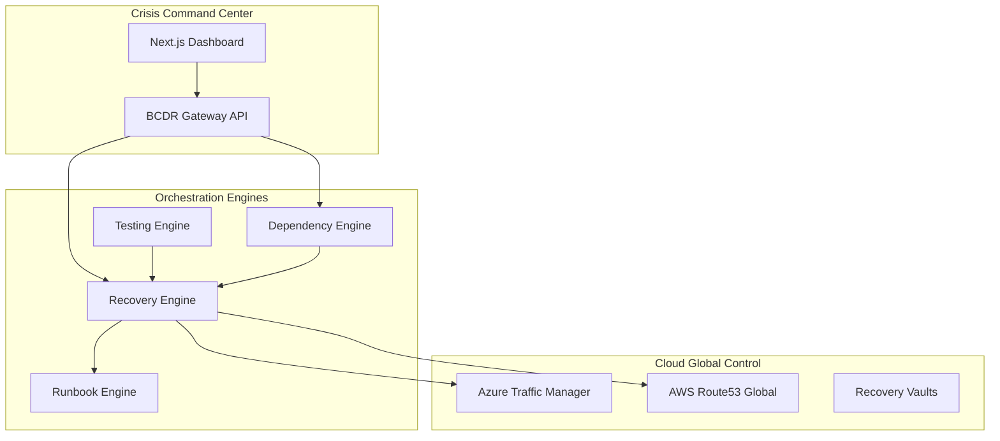
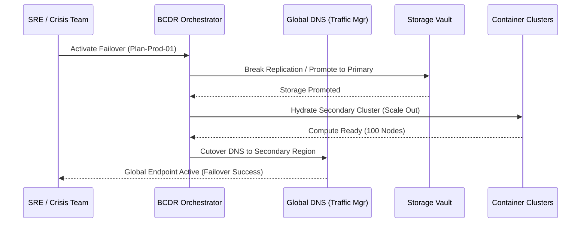
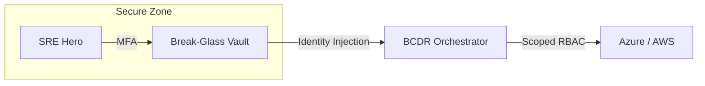

<div align="center">


<h1>BCDR Accelerator</h1>

<p><strong>The Enterprise Flagship Platform for Global Resilience, Automated Failover, and Disaster Recovery Orchestration</strong></p>

[]()
[]()
[]()
[]()

<br/>

> **"Resilience isn't luck; it's engineered."** 
> BCDR Accelerator is an institutional-grade platform designed to automate, validate, and operate recovery strategies across massive multi-cloud estates with zero-touch precision.

</div>

---

## 🏛️ Architecture Overview

The BCDR Accelerator follows a high-availability, command-and-control architecture with active-passive region orchestration.



### 💉 Failover Workflow (Tier-1 Application)



---

## 🚀 Business Outcomes

- **90% Reduction in MTTR**: Automated runbooks eliminate human-error during high-stress recovery events.
- **Continuous Readiness**: Scheduled DR drills provide the board with 24x7 visibility into organizational resilience.
- **Dependency Awareness**: Intelligent boot-order ensures that databases are always alive before the application tier attempts connection.
- **Regulatory Compliance**: Automated evidence packs generate SOC2/ISO audit response in seconds.

---

## 📂 Repository Structure

```text
bcdr-accelerator/
├── apps/
│   ├── portal/             # Next.js 14 Resilience Dashboard
│   ├── api/                # FastAPI Core Resilience Gateway
│   ├── recovery-engine/    # Global Failover Orchestrator
│   ├── testing-engine/     # Automated Drill Scheduler
│   └── dependency-engine/  # Topological Service Mapper
├── terraform/              # Enterprise Resilience IaC
│   ├── modules/            # Hardened VNet, AKS, Vault modules
│   └── environments/       # Prod/DR Region configurations
├── runbooks/               # Standardized Recovery Procedures
├── security/               # Break-glass & Crisis Access Controls
├── monitoring/             # Prometheus Resilience Alerts
├── .github/workflows/      # Resilience CI/CD Pipelines
└── README.md               # Boardroom Product Documentation
```

---

## 🚀 Deployment Guide

### 1. Provision Resilience Foundation (Terraform)
Provision the Hub and Spoke networking with global traffic management enabled.

```bash
cd terraform
terraform init
terraform apply -var="primary_region=uksouth" -var="secondary_region=ukwest"
```

### 2. Deploy Platform Services (Helm)
Deploy the BCDR control plane into your management cluster.

```bash
helm install bcdr-platform ./helm/bcdr-accelerator \
  --namespace resilience-ops \
  --create-namespace
```

---

## 🛡️ Security Trust Boundary



- **MFA Enforcement**: All failover triggers require multi-factor session validation.
- **Break-Glass**: Automated "Crisis Access" identities are spawned during Tier-0 failovers with 4h TTL.
- **Encryption**: FIPS-140-2 compliant storage for all recovery metadata.

---

## 🤝 Support & Roadmap
- **Resilience Consulting**: resilience@devopstrio.com
- **Enterprise Status**: [Status Page](https://status.devopstrio.com)

<div align="center">


**Building the future of enterprise infrastructure — one blueprint at a time.**

</div>
